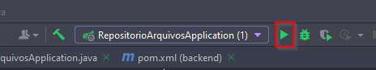

# Documentação para Rodar o Projeto Localmente

## Pré-requisitos
Antes de começar, certifique-se de ter os seguintes itens instalados:

- **Git**: Para clonar o repositório.
- **JDK 17**: Para rodar o backend Spring Boot.
- **Node.js (v18.x ou superior)**: Para rodar o frontend React.
- **Maven**: Para gerenciar dependências do Spring Boot.
- **Docker (opcional)**: Para rodar a aplicação em containers.
- **Postman**: Para testar as rotas da API.

---

### vale ressaltar que para este projeto, foram utilizadas as tecnologias React.js + vite para o front-end, Springboot 3.3.4 para o backend e o H2Database para base de dados(rodando em conjunto com spring). 

## Passo a Passo para Rodar o Projeto

### 1. Clonar o Repositório

Clone o repositório para sua máquina local:

```bash
git clone https://github.com/stcf29/gerenciador-arquivos
```

Em seguida, entre na pasta raiz do projeto **gerenciador-arquivos**.

---

### 2. Rodar o Backend Localmente

Para rodar o backend em Spring Boot, você pode utilizar o IntelliJ IDEA. Esta IDE já configura o JDK 17 e a base de dados H2 (em memória) ao executar o projeto.

1. Abra a pasta "backend" no IntelliJ.
2. Localize e execute a aplicação clicando em "Run" no canto superior direito da IDE:



3. O backend estará disponível em `http://localhost:8080`.

Se preferir usar o Maven via terminal, execute os comandos abaixo no diretório `backend`:

```bash
mvn clean install
mvn spring-boot:run
```

#### 2.1. Endpoints da API

- **GET** `/api/diretorios`: Retorna todos os diretórios e seus arquivos.
- **POST** `/api/diretorios`: Cria um novo diretório.
- **PUT** `/api/diretorios/{id}`: Atualiza um diretório existente.
- **DELETE** `/api/diretorios/{id}`: Remove um diretório.

---

### 3. Rodar o Frontend Localmente

Para rodar o frontend, siga os passos:

1. Navegue até a pasta `front-rep-arquivos`.
2. Abra o terminal e execute o comando:

```bash
npm run dev
```

O frontend estará disponível em `http://localhost:5173/` e já está configurado para apontar para o backend.

---

### 4. Rodar com Docker (Opcional)

#### 4.1. Build das Imagens Docker

No diretório raiz do projeto, execute o seguinte comando para construir as imagens do backend e frontend:

```bash
docker-compose up --build
```

Após o build, inicie os containers com:

```bash
docker-compose up
```

- O backend estará disponível em `http://localhost:8080`.
- O frontend estará disponível em `http://localhost:5174`.

---

### 5. Testar a API

Você pode testar os endpoints da API utilizando o **Postman**.

Na pasta raiz do projeto, haverá uma coleção do Postman chamada **Gerenciar-arquivos.postman_collection** com requisições já prontas.

#### 5.1. Exemplos de Requisições

**Requisição POST sem subdiretório:**

```json
{
  "nome": "Documentos",
  "parentDirectory": null,
  "files": [
    {
      "nome": "Arquivo1.txt",
      "tamanho": "15KB"
    }
  ]
}
```

**Requisição POST com subdiretório:**

```json
{
  "nome": "Documentos_teste",
  "parentDirectory": null,
  "subDirectories": [
    {
      "nome": "Subdiretório 1",
      "files": [
        {
          "nome": "Arquivo1.txt",
          "tamanho": "15KB"
        }
      ]
    }
  ],
  "files": [
    {
      "nome": "Arquivo1.txt",
      "tamanho": "15KB"
    }
  ]
}
```

---

### 6. Rodando os Testes

#### Testes Backend

Para rodar os testes no backend (Spring Boot), utilize o comando no diretório `backend`:

```bash
mvn test
```

#### Testes Frontend

No frontend (React), execute os testes na pasta `front-rep-arquivos` com o comando:

```bash
npm test
```

---

Seguindo estes passos, você poderá rodar a aplicação localmente.
